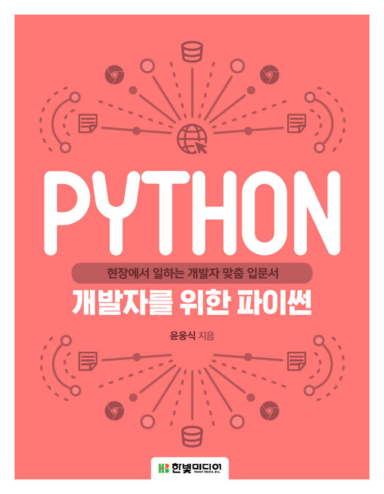
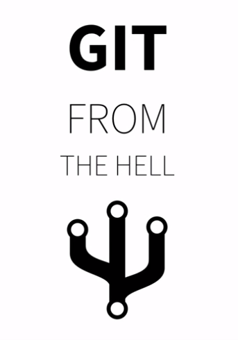
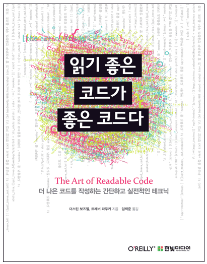
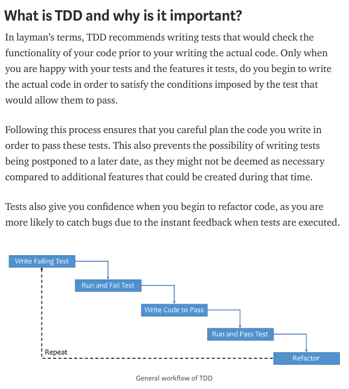
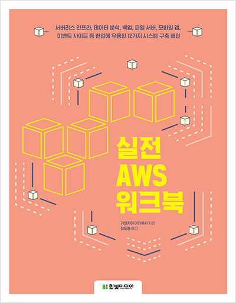
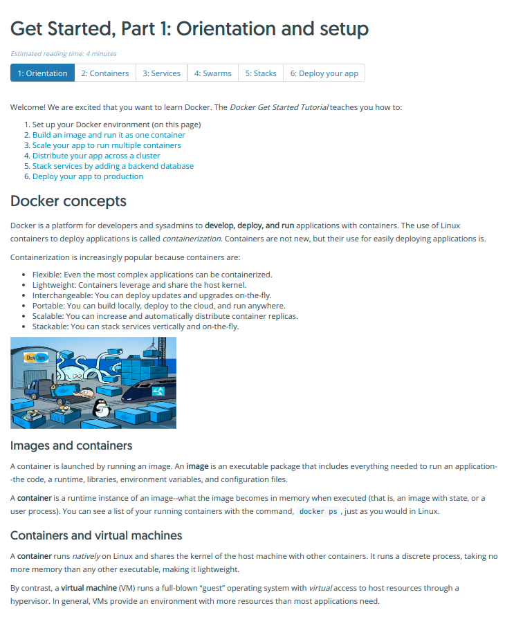

# Fungramming

[재미그래밍 프로젝트](https://github.com/Fungramming/Blackruby_Roadmap)

| 주차  | 주제          | 도서 및 강의              | 이미지                                      | 한 줄 후기                                                                                           |
| --- | ----------- | -------------------- | ---------------------------------------- | ------------------------------------------------------------------------------------------------ |
| 1주  | Python      | 개발자를 위한 파이썬          |  | 파이썬을 조금이라도 접해본 사람이 보면 좋을 책   실무에 적용하기 위해선 더 심화된 공부를 해야함                                       |
| 2주  | Flask       | 플라스크 웹개발             |   | 플라스크를 접하는 입문자가 보기엔 힘들다는 느낌 개념에 정의가 없는 경우도 있었고 처음부터 전문용어 사용 하지만 플라스크엔 이만한 입문서가 없다는게 안타까운 현실 |
| 3주  | Git         | 지옥에서 온 Git           |   | Git의 본질적인 원리에 대해 알게된 강의                                                                          |
| 4주  | Style Guide | 읽기 좋은 코드가  좋은 코드다 |   | 핵심은 무조건 짧은 코드가 아니라 사용자의 입장이 우선해야 함                                                               |
| 5주  | TDD         | Python 기본 TDD        |   | Python을 활용해 TDD를 활용하는 방법을 확인할 수 있었음                                                              |
| 6주  | AWS         | 실전 AWS 워크북           |   | AWS를 활용한 프로젝트 진행 시 전반적인 흐름파악에 용이                                                                                      |
| 7주  | Docker         | Docker docs           |   | 진행중                                                                                      |
