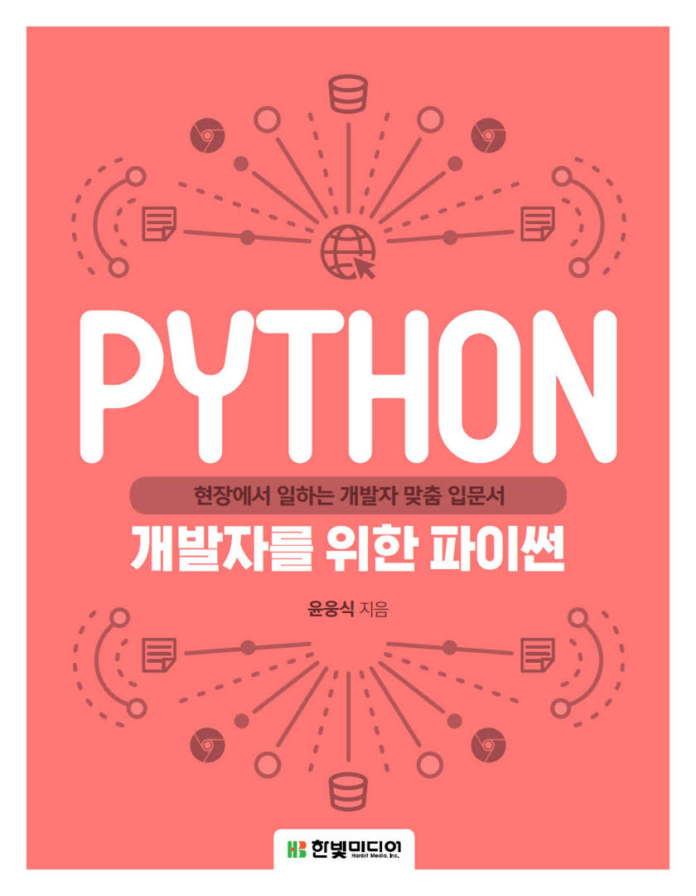

## 개발자를 위한 파이썬

### Contents

#### PART1. 빠르게 살펴보는 파이썬 기초

- Chapter1 파이썬 프로그래밍 준비와 시작
- Chapter2 파이썬의 주요 특징
- Chapter3 데이터 타입과 기본 연산자
- Chapter4 흐름 제어와 예외 처리
- Chapter5 함수와 람다
- Chapter6 객체지향과 클래스
- Chapter7 모듈과 패키지
- Chapter8 파일 읽고 쓰기

#### PART2. 도전! 파이썬 실무 예제

- Chapter9 크롤링 애플리케이션 만들기
- Chapter10 SQLite 데이터베이스 사용하기
- Chapter11 플라스크로 API 서버 만들기
- Chapter12 슬랙 봇 만들기
- Chapter13 메시지 큐 만들기
- Chapter14 팬더스로 데이터 분석하기
- Chapter15 Open API로 매시업 API서버 만들기
